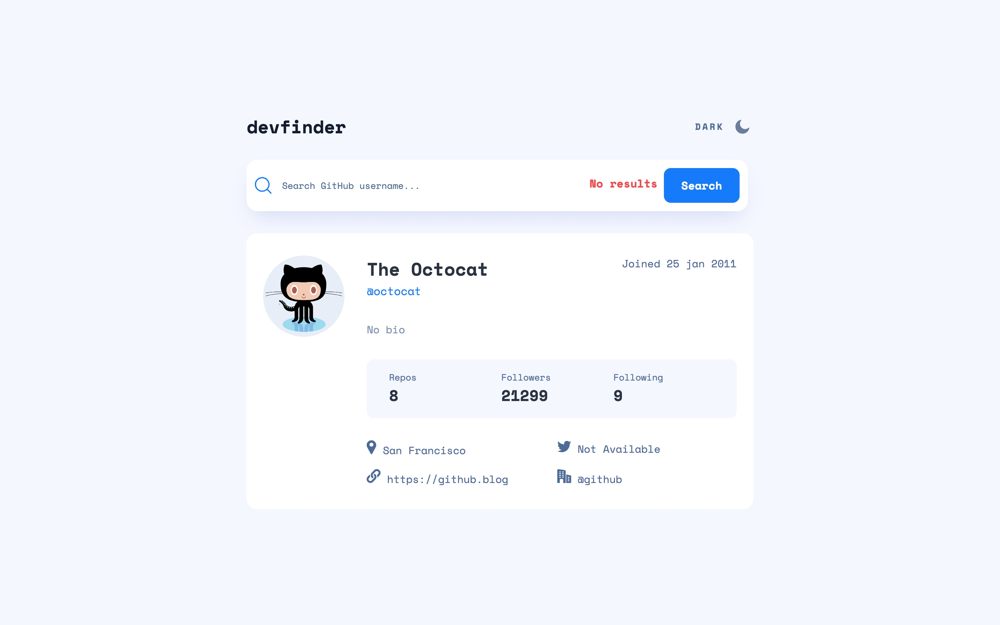

# Frontend Mentor - GitHub user search app solution

This is a solution to the [GitHub user search app challenge on Frontend Mentor](https://www.frontendmentor.io/challenges/github-user-search-app-Q09YOgaH6). Frontend Mentor challenges help you improve your coding skills by building realistic projects.

## Table of contents

- [Overview](#overview)
  - [The challenge](#the-challenge)
  - [Screenshot](#screenshot)
  - [Links](#links)
- [My process](#my-process)
  - [Built with](#built-with)
  - [Continued Development](#continued-development)
  - [Useful resources](#useful-resources)
- [Author](#author)

## Overview

### The challenge

Users should be able to:

- View the optimal layout for the app depending on their device's screen size
- See hover states for all interactive elements on the page
- Search for GitHub users by their username
- See relevant user information based on their search
- Switch between light and dark themes
- **Bonus**: Have the correct color scheme chosen for them based on their computer preferences. _Hint_: Research `prefers-color-scheme` in CSS.

### Screenshot

### Links

- Solution URL: [Github](https://github.com/katrien-s/fe-25-006-github-user-search-app)
- Live Site URL: [Netlify](https://fe-25-006-github-user-search-app.netlify.app/)

## My process

### Built with

- Semantic HTML5 markup
- CSS custom properties
- Flexbox
- CSS Grid
- Mobile-first workflow

### Continued Development

- ~~For now the screen flickers a little bit of white before switching to dark mode. I still need to implement a solution for that.~~
- ~~I also need to include a backup solution for when GitHub returns an undefined or a 403 in the fetch-request.~~

### Useful resources

- [How to create a theme switcher with HTML & CSS](https://www.youtube.com/watch?v=fyuao3G-2qg)
- [Building a theme switch component](https://web.dev/articles/building/a-theme-switch-component)

## Author

- Frontend Mentor - [@katrien-s](https://www.frontendmentor.io/profile/katrien-s)
